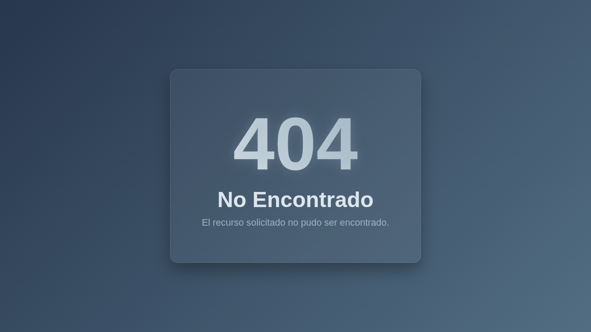
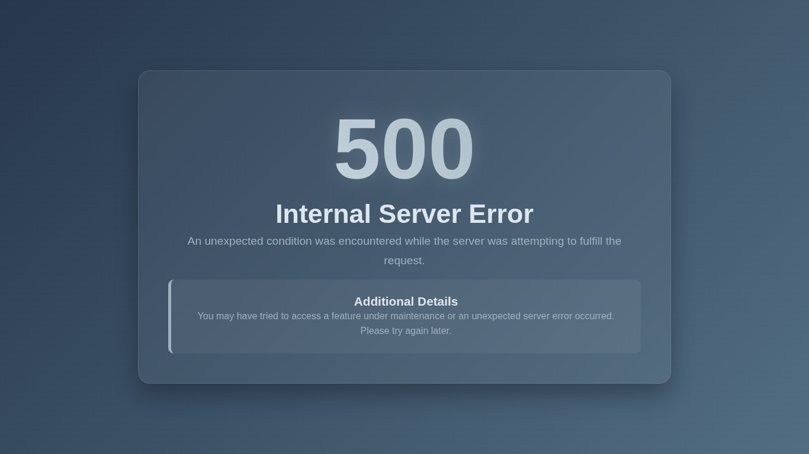

# Generador de Páginas de Error HTTP

Herramienta simple para generar páginas HTML de error HTTP usando datos JSON y plantillas Jinja2. 

Útil para configurar páginas de error personalizadas en servidores web como nginx, Apache u otros.

## Instalación

1. Instala Python 3.6+.
2. Instala dependencias: `pip install jinja2`

## Uso

Genera una página de error desde un archivo JSON:

```bash
python main.py --json-file data/500.json --output-file error_500.html
```

Para generar todas las páginas automáticamente de la carpeta `data/` en `output/`:

```bash
mkdir -p output && for json_file in data/*.json; do base=$(basename "$json_file" .json); python main.py --json-file "$json_file" --output-file "output/${base}.html"; done
```

## Estructura del Proyecto

- `data/`: Archivos JSON con datos de errores HTTP.
- `templates/`: Plantillas Jinja2 (ej. `http_error.html`).
- `main.py`: Script principal para generar páginas.

## Estructura del JSON

Los archivos JSON en `data/` definen los datos del error. Campos obligatorios: `code` y `code_phrase`. Campos opcionales: `description`, `details`, `details_title`, `language`, `title`, `icon`, `icon_type`.

## Ejemplos

### Error 404

[]()

```json
{
    "code": 404,
    "code_phrase": "No Encontrado",
    "description": "El recurso solicitado no pudo ser encontrado.",
    "language": "es"
}
```

### Error 500

[]()
```json
{
    "code": 500,
    "code_phrase": "Internal Server Error",
    "description": "An unexpected condition was encountered while the server was attempting to fulfill the request.",
    "details_title": "Additional Details",
    "details": "You may have tried to access a feature under maintenance or an unexpected server error occurred. Please try again later.",
    "language": "en",
    "title": "My Website - Internal Server Error",
    "icon": "https://cdn-icons-png.flaticon.com/512/8502/8502987.png",
    "icon_type": "png"
}
```

Personaliza agregando campos opcionales como `details` para más información o `icon` para un favicon.

## Contribución

Contribuciones bienvenidas. Abre un issue o pull request.
